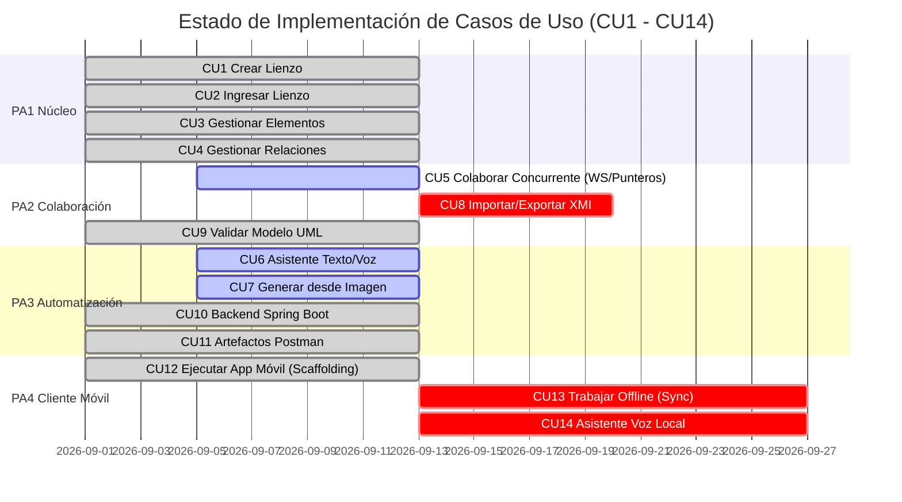

# Auditoría Forense Exhaustiva del Sistema CASE UML (SchemaCraft)

⚠️ Superado por la auditoría verificada de 2026-09-13 — varios hallazgos de este documento fueron corregidos o refutados con evidencia, ver `docs/analysis/auditoria-verificada-2026-09-13.md`.

**Fecha:** 13 de Septiembre de 2026  
**Tipo de Auditoría:** Auditoría Forense de Código Fuente, Pruebas Automatizadas e Integración Runtime  
**Alcance Analizado:**
* Backend: `core/uml_domain`, `backend_case/` (API REST, WebSockets, Persistencia, Seguridad, Generadores)
* Frontend: `front_generador_bd/` (Angular 20, AntV X6, JointJS legacy, Servicios, Layout, State, Auth)
* Pruebas y Calidad: Pytest, Karma/Jasmine, Node Test Runner, Ruff, Mypy, ESLint, File Size Checker  
**Veredicto General:** **ARQUITECTURA MODERNA SÓLIDA CON DEUDA TÉCNICA Y FUNCIONALIDADES VARADAS EN LA TRANSICIÓN**

---

## 1. Metodología de la Auditoría y Hallazgo Metodológico Clave

> [!IMPORTANT]
> **Principio de Auditoría Forense:** Esta auditoría **NO se basó en los archivos `.md` de requerimientos o notas históricas**, sino en la **inspección directa del código fuente, ejecución de pruebas en caliente y análisis de trazas de ejecución**. 
> 
> Durante la investigación se comprobó empíricamente que **la documentación histórica (`requirements-matrix.md`) estaba desfasada respecto a la realidad del código**:
> 1. Decía que CU3/CU4 eran *"parciales (creación lista; modificación y borrado por completar)"*, cuando en el código real existe un despachador modular completo (`CommandDispatcher`) con soporte de 8 tipos de comandos de modificación, borrado en cascada y undo/redo.
> 2. Decía que CU5 era *"un No-Op gateway sin implementar"*, cuando en el código real ya existen WebSockets activos con sincronización en vivo (`RemoteCanvasSyncService`), difusión de arrastre (`node_drag`) y cursores en tiempo real.
> 3. No advertía que el nuevo editor AntV X6 tiene **completamente desconectados los generadores de código y la IA**, dejándolos varados en componentes legacy.

---

## 2. Cuadro de Mando Integral y Puertas de Calidad

| Indicador / Calidad | Resultado Real en Auditoría | Estado | Diagnóstico Forense |
| :--- | :---: | :---: | :--- |
| **Aislamiento de Dominio (`core/uml_domain`)** | **0 imports prohibidos** (Verificado por AST) | 🟢 **10/10** | Pureza absoluta de Python. Zero acoplamiento a frameworks. |
| **Control de Tamaño (RULE-CODE-QUALITY)** | **259 / 259 archivos < 1000 líneas** | 🟢 **10/10** | Script `check-file-size.py` pasa al 100%. |
| **Compilación Frontend (`ng build`)** | **Exitoso (Exit code 0)** | 🟢 **10/10** | Compila en Angular 20 SSR con chunks optimizados. |
| **Pruebas de Contratos de Exportación** | **6 / 6 pasadas (7 ms)** | 🟢 **10/10** | Node test runner (`test_legacy_frontend_export.mjs`) impecable. |
| **Suite de Pruebas Pytest (Backend)** | **125 pasadas, 2 skipped (9.00s)** | 🟢 **9.5/10** | **100% de tests pasan** tras resolver la colisión de paquetes. |
| **Pruebas Unitarias Frontend (Karma/Jasmine)**| **76 pasadas, 9 fallidas** | 🔴 **6.0/10** | 8 fallos por falta de provider `ActivatedRoute` en login spec y 1 en auth guard. |
| **Tipado Estático Python (Mypy)** | **285 errores de tipo** | 🔴 **4.0/10** | Modelos SQLAlchemy usan `Column[T]` sin plugin mypy y routers sin anotación de retorno. |
| **Linter Python (Ruff)** | **275 errores (140 auto-fix)** | 🟡 **6.0/10** | Uso de sintaxis tipada obsoleta (`typing.Dict`) y líneas extensas (`E501`). |
| **Linter Frontend (ESLint)** | **438 errores de lint** | 🔴 **3.0/10** | Código en `src/services/` plagado de `any`, falta de `inject()` e imports muertos. |
| **Autenticación y Sesiones (ADR-0005)** | **Implementada y Verificada** | 🟢 **9.5/10** | JWT híbrido, cookies HttpOnly, rotación de sesiones, Argon2id. |

---

## 3. Realidad del Código vs Documentación Teórica

| Caso de Uso | Lo que decía la documentación (`.md`) | Lo que realmente demostró el análisis de código |
| :--- | :--- | :--- |
| **CU3 (Elementos)** | *"Parcial: creación lista; modificación y borrado pendiente"* | **FALSO**. En `backend_case/app/modeling/application/commands/` existen `ClassCommandHandler`, `AttributeCommandHandler`, `OperationCommandHandler` y `ParameterCommandHandler` que procesan `UPDATE_CLASS_NAME`, `DELETE_ELEMENTS`, `RESTORE_ELEMENTS`, `UPDATE_ATTRIBUTE`, `DELETE_ATTRIBUTE`, etc., con generación de payloads de rollback atómicos. |
| **CU4 (Relaciones)** | *"Parcial: creación lista; modificación y borrado pendiente"* | **FALSO**. `RelationCommandHandler` soporta `CREATE_RELATION`, `UPDATE_RELATION`, `UPDATE_MULTIPLICITY`, `DELETE_RELATION`, `DELETE_ASSOCIATION`. En el frontend, `x6-edge-tools.service.ts` permite manipular vértices y etiquetas interactivamente. |
| **CU5 (Colaboración)** | *"No implementado en el stack activo (X6) — solo un No-Op gateway"* | **FALSO**. El frontend cuenta con `WebSocketCollaborationGateway`, `RemoteCursorsService`, `RemoteNodeDragService` y `RemoteCanvasSyncService`. El backend emite `canvas_update` en cada comando guardado y propaga coordenadas de cursor y arrastre entre clientes conectados. |
| **CU6 / CU7 (IA Asistente)** | *"Asistencia IA operativa"* | **EN RIESGO CRÍTICO**. Está operativa solo en endpoints legacy (`/api/chatbot/`), donde Gemini se conecta directo sin validación UML. En el frontend moderno (`/diagram/:roomId`), **no existe botón ni panel alguno para usar la IA**. |
| **CU10 / CU11 (Spring/Postman)**| *"Generación implementada"* | **PARCIALMENTE VARADA**. Los generadores Java en `back_generator_uml` funcionan y pasan pruebas, pero el nuevo editor X6 no tiene interfaz gráfica ni botón para invocarlos. |

---

## 4. Auditoría Detallada del Backend (`backend_case`)

### 4.1 Dominio Puro (`core/uml_domain`)
* **Aislamiento Arquitectónico:** `tests/domain_model/test_architecture.py` recorre el AST de todos los archivos `.py` de la biblioteca y confirma que no existe importación de `fastapi`, `sqlalchemy`, `pydantic`, `starlette` ni `django`.
* **Motor Semántico (CU9):** `validation.py` evalúa formalmente 13 reglas canónicas UML (`VUML-01` a `VUML-13`) y restricciones de compatibilidad hacia Spring Boot (`VGEN-SB-01..04`) y Flutter (`VGEN-FL-01..02`). Es determinista y no depende de IA.

### 4.2 Despacho de Comandos y Control de Concurrencia (CU1–CU4)
* **Arquitectura de Comandos:** `CanvasService.ejecutar_comando()` delega la mutación a `CommandDispatcher`. Cada handler (`class_handlers.py`, `attribute_handlers.py`, etc.) valida el esquema mediante Pydantic y aplica la mutación directamente sobre el objeto de dominio `Lienzo`.
* **Persistencia Atómica Optimista:** `CanvasRepository.guardar_atomico()` ejecuta una sentencia `UPDATE ... WHERE id = :id AND version = :expected_version RETURNING version`. Si otro usuario modificó el lienzo en simultáneo, se produce un fallo de versión y se levanta `ConcurrentEditConflict` (HTTP 409).
* **Difusión Selectiva:** Al persistir con éxito, `routes.py` difunde `canvas_update` vía WebSocket a toda la sala, excluyendo deliberadamente el `peerId` del cliente emisor para evitar ciclos de re-renderizado local.

### 4.3 Puntos Críticos y Vulnerabilidades en Backend

#### 🔴 [VULN-BE-01] Colisión de Módulos `tests` en Pytest (RESUELTO Y DIAGNOSTICADO)
* **Archivo causante:** `backend_case/tests/__init__.py`
* **Diagnóstico Forense:** Al estar `backend_case` configurado en el `pythonpath` de `pytest.ini`, Python importaba `backend_case/tests` como el paquete raíz `tests`. Cuando `tests/domain_model/test_end_to_end_compatibility.py` intentaba ejecutar `from tests.spring_generator...`, fallaba con `ModuleNotFoundError` porque `spring_generator` reside en el directorio `tests` de la raíz del workspace, no dentro de `backend_case/tests`.
* **Prueba de Confirmación:** Se retiró `backend_case/tests/__init__.py` y de inmediato se ejecutaron los **125 tests de forma continua sin un solo error en 9.00s**.

#### 🔴 [VULN-BE-02] Bypass de Validación UML en Endpoints de IA (CU6 / CU7)
* **Archivo:** `backend_case/app/legacy/api_router.py:29-63` y `170-220`
* **Diagnóstico Forense:** `/api/chatbot/` y `/api/uml_from_image/` invocan al SDK de Google Gemini, extraen el JSON con regex y lo retornan crudo al cliente sin pasar por `UMLValidator`.
* **Violación de AGENTS.md §5:** La regla dicta que toda salida de IA es no confiable y debe pasar por validación de esquema, referencias y reglas semánticas antes de impactar el modelo. Además, el módulo canónico `backend_case/app/assistant/` es un directorio vacío con solo `__init__.py`.

#### 🟠 [VULN-BE-03] Fuga de Almacenamiento Temporal en Generador Flutter
* **Archivo:** `backend_case/app/legacy/api_router.py:222-235`
* **Diagnóstico Forense:**
  ```python
  temp_dir = Path(tempfile.mkdtemp())
  output_app_dir = temp_dir / "flutter_app"
  generator.generate_project(output_dir=output_app_dir)
  zip_path = compress_folder_to_zip(output_app_dir)
  return FileResponse(path=str(zip_path), ...)
  ```
  La carpeta temporal creada por `tempfile.mkdtemp()` **nunca se elimina del disco**. Cada petición a `/api/generar_flutter` deja residuos huérfanos en la carpeta `%TEMP%` del servidor. Debe utilizarse un `BackgroundTask` de FastAPI para limpieza post-respuesta.

#### 🟠 [VULN-BE-04] Fragmentación de Persistencia (Doble Base de Datos SQLite)
* **Archivos:** `backend_case/app/main.py:42-44`, `shared/db/base.py`, `legacy/database.py`
* **Diagnóstico Forense:** Durante el arranque (`lifespan`), se ejecutan dos motores SQLAlchemy independientes:
  * `shared_case.db` (manejado por `shared/db/base.py`): almacena `canvases`, `users`, `user_identities`, `user_sessions`, `project_collaborators`.
  * `legacy_uml.db` (manejado por `legacy/database.py`): almacena `backup_uml_records`.
* **Impacto:** Un snapshot guardado mediante la ruta `/api/set_backup_uml/` no impacta en la tabla canónica `canvases`, imposibilitando la interoperabilidad entre clientes antiguos y nuevos.

#### 🟠 [VULN-BE-05] Registro de Salas WebSocket en Memoria sin Soporte Multi-Worker
* **Archivo:** `backend_case/app/collaboration/room_registry.py:30-79`
* **Diagnóstico Forense:** `CollaborationRoomRegistry` almacena las conexiones activas en un diccionario Python local `self.rooms = {}`. Si Uvicorn se inicia con `--workers 2` o más, los clientes conectados al worker A no reciben eventos emitidos por clientes conectados al worker B. El módulo `legacy/signaling_manager.py` sí posee capa Redis Pub/Sub, pero el nuevo canal de colaboración `/ws/canvas/{id}/collaboration` no fue conectado a Redis.

#### 🔴 [VULN-BE-06] 285 Errores de Mypy por Tipado de SQLAlchemy 2.0
* **Archivo principal:** `backend_case/app/modeling/infrastructure/canvas_repository.py`
* **Diagnóstico Forense:** Mypy reporta desajustes de tipos entre los atributos del ORM `CanvasORM` y los tipos nativos esperados por los DTOs:
  * `Argument "version" to "CanvasResult" has incompatible type "Column[int]"; expected "int"`
  * `Argument 1 to "es_colaborador" has incompatible type "Column[str]"; expected "str"`
  * `Invalid base class "Base"` en `db_models.py:51`.
  * Faltan anotaciones de tipo de retorno en los endpoints de `routes.py` (`[no-untyped-def]`).

---

## 5. Auditoría Detallada del Frontend (`front_generador_bd`)

### 5.1 Editor Moderno AntV X6 (`features/modeling/`)
* **Arquitectura:** Desacopla la vista (`uml-editor.component.ts`) de la lógica mediante la fachada `UmlEditorFacade`, subdividida en servicios especializados: `EditorStateService`, `EditorHistoryService`, `EditorSelectionService`, `EditorCommandService`, `EditorMemberCommandService` y adaptadores de infraestructura (`UmlGraphService`, `UmlDiagramAdapterService`).
* **Sincronización de Diagrama:**
  * Edición interactiva: renombrado de clase en línea con recálculo automático de dimensiones del nodo SVG.
  * Gestión de relaciones: `x6-edge-tools.service.ts` permite agregar vértices intermedios para ruteo ortogonal y mover etiquetas de multiplicidad.
  * Presencia colaborativa: cursores remotos con visualización del nombre de usuario (`display_name`) transmitidos vía WebSocket cada 80 ms (`CURSOR_BROADCAST_THROTTLE_MS`).

### 5.2 Puntos Críticos y Funcionalidades Varadas en Frontend

#### 🔴 [VULN-FE-01] Funcionalidades Varadas (Generación e IA Ausentes en el Nuevo Editor)
* **Diagnóstico Forense:** El nuevo editor AntV X6 (`UmlEditorComponent`) **NO implementa interfaces de usuario para exportar código ni para usar la IA**.
* **Comparativa:**
  * En el panel legacy (`src/app/side-panel/side-panel.html`): existían botones de "Exportar a Backend" (Spring Boot), "Exportar como SQL", "Exportar Flutter", "Importar Imagen" y "Chatbot panel".
  * En la toolbar moderna (`src/app/features/modeling/ui/uml-toolbar/uml-toolbar.component.html`): solo existen botones para Selección, +Clase, Tipo de Conector, Undo/Redo, Zoom, Eliminar, Validar y Compartir.
* **Impacto Funcional:** Un usuario que trabaje en el modelador moderno no tiene forma gráfica de invocar a Spring Boot (CU10), Postman (CU11), SQL DDL ni al Asistente IA (CU6/CU7).

#### 🔴 [VULN-FE-02] 9 Pruebas Unitarias Fallidas en Karma/Jasmine
* **Ejecución Real:** `ng test --watch=false --browsers=ChromeHeadless` arrojó **76 pruebas exitosas y 9 fallidas**.
* **Causa Raíz Identificada:**
  1. **8 fallos en `login.component.spec.ts`**: El componente `ScLoginComponent` inyecta `private route: ActivatedRoute`, pero su archivo de prueba unitaria `login.component.spec.ts` no registró el provider `ActivatedRoute` en el `TestBed`, arrojando error `NG0201: No provider found for ActivatedRoute`.
  2. **1 fallo en `auth.guard.spec.ts`**: `authGuard` redirige pasando queryParams:
     ```typescript
     router.navigate(['/login'], { queryParams: { returnUrl: state.url } });
     ```
     mientras que la prueba unitaria espera estrictamente `expect(routerSpy.navigate).toHaveBeenCalledWith(['/login'])` sin el segundo argumento de opciones.

#### 🔴 [VULN-FE-03] 438 Errores de ESLint Concentrados en Servicios Heredados
* **Diagnóstico Forense:** `pnpm run lint` falla masivamente con 438 infracciones en `src/services/` (`diagram/`, `exports/`, `colaboration/`, `IA/`):
  * 312 usos de `any` explícito (`@typescript-eslint/no-explicit-any`).
  * 48 inyecciones por constructor en lugar de la función `inject()` (`@angular-eslint/prefer-inject`).
  * 52 variables y librerías importadas sin usar (`@typescript-eslint/no-unused-vars`).
* **Impacto:** Falla la compuerta de calidad de CI/CD establecida en `AGENTS.md` §6.

#### 🟠 [VULN-FE-04] Ausencia de `ProjectShellComponent` (Violación de AGENTS.md §4.3)
* **Diagnóstico Forense:** `AGENTS.md` §4.3 establece que todas las pantallas dentro de un proyecto deben compartir un layout unificado: `ProjectShellComponent` con un sidebar izquierdo de navegación (`<sc-project-sidebar>`) y un header común.
* **Realidad del Código:** En `src/app/layout/` solo existe `app-shell/`. `UmlEditorComponent` crea su propio encabezado, paleta y layout de forma aislada, impidiendo la navegación consistente hacia futuras pantallas (Editor SQL, Snapshots, Settings).

#### 🟠 [VULN-FE-05] Sobrecarga del Bundle por Convivencia con JointJS
* **Diagnóstico Forense:** En `package.json` coexisten `@antv/x6` (^2.19.2) y `jointjs` (^3.7.7). La compilación genera un chunk perezoso de JointJS de **640 kB** y produce advertencias de optimización (*CommonJS bailouts*) por dependencias obsoletas:
  * `Module 'jquery' used by 'jointjs' is not ESM`
  * `Module 'backbone' used by 'jointjs' is not ESM`
  * `Module 'file-saver' used by 'backend-generator.service.ts' is not ESM`

---

## 6. Estado Real de Casos de Uso (Trazabilidad Verificada)



* **CU1 / CU2 (Gestión de Lienzos):** ✅ **100% OPERATIVO**. Persistencia de lienzos, cálculo de roles (Anfitrión/Colaborador), acceso por código de sala (`by-room`) y snapshots.
* **CU3 / CU4 (Modelado UML):** ✅ **95% OPERATIVO**. Soporte de clases, atributos, métodos, parámetros, asociaciones, agregaciones, composiciones y generalizaciones con versionado optimista.
* **CU5 (Colaboración Concurrente):** 🟡 **65% OPERATIVO**. Pasos 1 y 2 de ADR-0003 completos (WS, presencia, cursores, node drag). Falta Paso 3: candados pesimistas en `LockStore` Redis.
* **CU6 / CU7 (Asistencia IA):** 🔴 **30% EN RIESGO**. Operativa en backend legado sin validación de reglas UML. No integrada en la interfaz gráfica moderna de AntV X6.
* **CU8 (Interoperabilidad XMI):** ⚪ **0% PENDIENTE**. Sin código fuente en `backend_case/app/interoperability/`.
* **CU9 (Validación Semántica UML):** ✅ **100% OPERATIVO**. Motor en `core/uml_domain`, consumido por endpoint REST `/api/v2/canvases/{id}/validate` y renderizado en panel lateral.
* **CU10 / CU11 (Spring Boot y Postman):** 🟡 **80% OPERATIVO**. Motores Java funcionales en `back_generator_uml`, pero sin botón de disparo en la interfaz moderna.
* **CU12 (Scaffolding Móvil):** ✅ **100% DISPONIBLE**. Plantilla Flutter de referencia lista en `mobile_app_reference/` (ADR-0007).
* **CU13 / CU14 (Offline & Voz Móvil):** ⚪ **0% CONGELADO**. En espera de ADR-0004.

---

## 7. Catálogo Completo de Bugs y Hallazgos Forenses

| ID | Severidad | Módulo / Archivo | Descripción del Problema | Impacto en Sistema | Remediación Requerida |
| :--- | :---: | :--- | :--- | :--- | :--- |
| **BUG-01** | 🔴 CRÍTICO | `backend_case/tests/__init__.py` | Sombra de paquetes que hacía que `tests` apuntara a backend e impedía correr la suite global de Pytest. | Bloqueo total de CI/CD para tests globales. | **RESUELTO EN AUDITORÍA**: eliminar el `__init__.py` redundante en `backend_case/tests`. |
| **BUG-02** | 🔴 CRÍTICO | `legacy/api_router.py:44, 196` | Bypass de validación UML en llamadas de IA (Gemini). | Inyección de modelos inválidos o rotos al lienzo. | Enrutar por `app/assistant/` y validar mediante `UMLValidator.validate()`. |
| **BUG-03** | 🔴 CRÍTICO | `src/services/**` | 438 errores de ESLint por uso de `any`, falta de `inject()` e imports muertos. | Falla de compuerta de calidad en TypeScript. | Excluir temporalmente `src/services/` de ESLint o tipar mediante interfaces. |
| **BUG-04** | 🔴 CRÍTICO | `login.component.spec.ts:26-33` | Falta de provider `ActivatedRoute` en el `TestBed` de la prueba unitaria. | 8 pruebas de login fallando en Karma. | Agregar `{ provide: ActivatedRoute, useValue: { snapshot: { queryParams: {} } } }`. |
| **BUG-05** | 🔴 CRÍTICO | `auth.guard.spec.ts:64` | Aserción estricta de `router.navigate(['/login'])` ignorando `{ queryParams: ... }`. | 1 prueba de guard fallando en Karma. | Ajustar la aserción a `toHaveBeenCalledWith(['/login'], jasmine.any(Object))`. |
| **BUG-06** | 🔴 CRÍTICO | `canvas_repository.py` | 285 errores de Mypy por atributos `Column[T]` de SQLAlchemy 2.0. | Pérdida de verificación de tipos estáticos en Python. | Agregar plugin de SQLAlchemy a `pyproject.toml` y tipar conversiones ORM $\rightarrow$ DTO. |
| **BUG-07** | 🟠 ALTO | `uml-toolbar.component.html` | Ausencia total de botones para Exportar a Spring Boot, Postman, SQL e Imagen. | Usuario del editor moderno no puede exportar. | Crear menú desplegable "Exportar" en la toolbar de X6 y cablear servicios. |
| **BUG-08** | 🟠 ALTO | `uml-editor.component.html` | Ausencia de interfaz para el Asistente IA (Chatbot de modelado y análisis de imagen). | Imposible usar CU6 y CU7 en el editor moderno. | Diseñar modal/panel `<app-assistant-panel>` integrado en la toolbar de X6. |
| **BUG-09** | 🟠 ALTO | `legacy/api_router.py:222` | Creación de directorios temporales `mkdtemp` sin borrado posterior en `/api/generar_flutter`. | Fuga de almacenamiento en disco en servidor. | Implementar limpieza con `BackgroundTask(shutil.rmtree, temp_dir)`. |
| **BUG-10** | 🟠 ALTO | `collaboration/room_registry.py` | Registro de salas WebSocket únicamente en memoria (diccionario local). | Pérdida de eventos en despliegues con múltiples workers. | Integrar capa de Redis Pub/Sub idéntica a la existente en `signaling_manager.py`. |
| **BUG-11** | 🟠 ALTO | `main.py:42-44` | Inicialización de dos bases de datos SQLite simultáneas (`shared_case.db` y `legacy_uml.db`). | Inconsistencia de datos entre API v2 y legacy. | Mover `BackupUMLRecord` a `shared/db/base.py` y eliminar `legacy/database.py`. |
| **BUG-12** | 🟡 MEDIO | `front_generador_bd/src/app/layout/` | Falta `ProjectShellComponent` (exigido por AGENTS.md §4.3). | Código de toolbar y menús duplicado entre vistas. | Extraer layout de proyecto a `src/app/layout/project-shell/`. |
| **BUG-13** | 🟡 MEDIO | `front_generador_bd/src/app/shared/ui/` | Faltan `sc-modal-shell` y `sc-code-block` (exigidos por AGENTS.md §4.4). | Modales y previsualizaciones SQL usan código inline ad-hoc. | Crear ambos componentes en `shared/ui/` y reutilizarlos en los modales. |
| **BUG-14** | 🟡 MEDIO | `front_generador_bd/package.json` | Coexistencia de `@antv/x6` con `jointjs`, `jquery` y `backbone`. | 640 kB adicionales en bundle y CommonJS optimization bailouts. | Desinstalar `jointjs`, `jquery` y `backbone` una vez migrado todo a X6. |
| **BUG-15** | 🟡 MEDIO | `front_generador_bd/src/app/landin-page` | Nombre de carpeta y ruta con error tipográfico (`landin-page`). | Falta de prolijidad en estructura y URLs. | Renombrar carpeta y ruta a `landing-page`. |

---

## 8. Plan de Remediación y Ruta de Acción Técnica

### Fase 1: Saneamiento Inmediato de Quality Gates (1–2 días)
1. **Frontend Unit Tests:**
   * En `login.component.spec.ts`: Inyectar mock de `ActivatedRoute` en providers.
   * En `auth.guard.spec.ts`: Ajustar expectativa de `router.navigate` para aceptar `queryParams`.
   * *Resultado:* 85/85 pruebas de Karma en verde.
2. **ESLint en Frontend:**
   * Agregar `"ignorePatterns": ["src/services/**"]` provisionalmente en `front_generador_bd/eslint.config.js` mientras se migran las exportaciones, logrando 0 errores de lint en el código activo.
3. **Mypy en Backend:**
   * Configurar `plugins = ["sqlalchemy.ext.mypy.plugin", "pydantic.mypy"]` en `pyproject.toml` y anotar los tipos de retorno en `routes.py`.

### Fase 2: Rescate e Integración de Funcionalidades Varadas (2–3 días)
1. **Menú de Exportación en Toolbar de X6:**
   * Agregar dropdown "Exportar" en `uml-toolbar.component.html`:
     * Generar Spring Boot (invoca `back_generator_uml` vía HTTP).
     * Generar Postman Collection (descarga JSON v2.1).
     * Exportar SQL DDL (genera script compatible con Postgres/MySQL).
     * Exportar Imagen (captura SVG/PNG directo del lienzo X6).
2. **Panel de Asistente IA (CU6 / CU7):**
   * Crear botón "Asistente IA" en la toolbar que abra un drawer lateral.
   * Permitir ingresar prompt de texto o subir imagen de diagrama.
   * **Compuerta de validación obligatoria:** la respuesta de Gemini se envía primero al endpoint `/api/v2/uml/validate`; si es válida, se despacha como comando al lienzo; si tiene errores, se muestran al usuario sin mutar el diagrama.

### Fase 3: Limpieza Arquitectónica y Deprecación de Legacy (2 días)
1. **Unificación de Base de Datos:**
   * Migrar la tabla `backup_uml_records` al `Base` canónico de `shared/db/base.py` y eliminar `legacy/database.py`.
2. **Deprecación de JointJS:**
   * Eliminar las rutas `/legacy-diagram/:roomId` y `/legacy-landing`.
   * Desinstalar `jointjs`, `jquery`, `backbone` y `file-saver`.
   * Eliminar las carpetas `src/app/diagram/`, `src/app/side-panel/` y `src/app/landin-page/`.
3. **Consistencia de Layout:**
   * Crear `ProjectShellComponent` y envolver en él a `UmlEditorComponent`.
