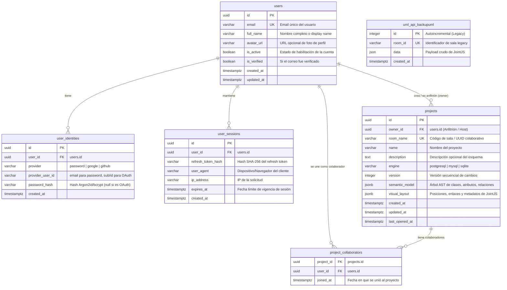

# Especificación y Esquema de Base de Datos — SchemaCraft CASE

Este documento es la **fuente de verdad oficial del modelo relacional de persistencia** para el sistema CASE colaborativo (`backend_case`). Define la estructura de tablas, tipos de datos, restricciones, claves foráneas e índices en PostgreSQL (compatible con SQLite en desarrollo local).

---

## 1. Diagrama Entidad-Relación (Mermaid)



---

## 2. Definición DDL de Tablas (PostgreSQL / Alembic)

### 2.1 Módulo de Identidad y Autenticación

```sql
-- 1. Usuarios Principales
CREATE TABLE users (
    id UUID PRIMARY KEY DEFAULT gen_random_uuid(),
    email VARCHAR(255) NOT NULL UNIQUE,
    full_name VARCHAR(150) NOT NULL,
    avatar_url VARCHAR(500) NULL,
    is_active BOOLEAN NOT NULL DEFAULT TRUE,
    is_verified BOOLEAN NOT NULL DEFAULT FALSE,
    created_at TIMESTAMP WITH TIME ZONE NOT NULL DEFAULT NOW(),
    updated_at TIMESTAMP WITH TIME ZONE NOT NULL DEFAULT NOW()
);

CREATE INDEX idx_users_email ON users(email);

-- 2. Métodos y Proveedores de Autenticación (1 Usuario : N Identidades)
CREATE TABLE user_identities (
    id UUID PRIMARY KEY DEFAULT gen_random_uuid(),
    user_id UUID NOT NULL REFERENCES users(id) ON DELETE CASCADE,
    provider VARCHAR(50) NOT NULL, -- 'password', 'google', 'github'
    provider_user_id VARCHAR(255) NOT NULL, -- email (password) o sub OIDC (Google)
    password_hash VARCHAR(255) NULL, -- solo para provider='password'
    created_at TIMESTAMP WITH TIME ZONE NOT NULL DEFAULT NOW(),
    CONSTRAINT uq_provider_identity UNIQUE(provider, provider_user_id)
);

CREATE INDEX idx_user_identities_lookup ON user_identities(provider, provider_user_id);
CREATE INDEX idx_user_identities_user_id ON user_identities(user_id);

-- 3. Sesiones Activas y Revocación de Tokens
CREATE TABLE user_sessions (
    id UUID PRIMARY KEY DEFAULT gen_random_uuid(),
    user_id UUID NOT NULL REFERENCES users(id) ON DELETE CASCADE,
    refresh_token_hash VARCHAR(255) NOT NULL UNIQUE,
    user_agent VARCHAR(255) NULL,
    ip_address VARCHAR(45) NULL,
    expires_at TIMESTAMP WITH TIME ZONE NOT NULL,
    created_at TIMESTAMP WITH TIME ZONE NOT NULL DEFAULT NOW()
);

CREATE INDEX idx_user_sessions_user_id ON user_sessions(user_id);
CREATE INDEX idx_user_sessions_expires_at ON user_sessions(expires_at);
```

---

### 2.2 Módulo de Modelado y Proyectos (`modeling`)

```sql
-- 4. Proyectos / Lienzos de Bases de Datos
CREATE TABLE projects (
    id UUID PRIMARY KEY DEFAULT gen_random_uuid(),
    owner_id UUID NOT NULL REFERENCES users(id) ON DELETE RESTRICT,
    room_name VARCHAR(100) NOT NULL UNIQUE,
    name VARCHAR(255) NOT NULL DEFAULT 'Diagrama Sin Título',
    description TEXT NULL,
    engine VARCHAR(30) NOT NULL DEFAULT 'postgresql', -- 'postgresql' | 'mysql' | 'sqlite'
    version INTEGER NOT NULL DEFAULT 1,
    semantic_model JSONB NOT NULL DEFAULT '{"classes":[],"relations":[],"packages":[]}'::jsonb,
    visual_layout JSONB NULL DEFAULT '{"cells":[]}'::jsonb,
    created_at TIMESTAMP WITH TIME ZONE NOT NULL DEFAULT NOW(),
    updated_at TIMESTAMP WITH TIME ZONE NOT NULL DEFAULT NOW(),
    last_opened_at TIMESTAMP WITH TIME ZONE NOT NULL DEFAULT NOW()
);

CREATE INDEX idx_projects_owner_id ON projects(owner_id);
CREATE INDEX idx_projects_room_name ON projects(room_name);
CREATE INDEX idx_projects_updated_at ON projects(updated_at DESC);

-- 5. Colaboradores de Proyectos (M:N entre Proyectos y Usuarios)
CREATE TABLE project_collaborators (
    project_id UUID NOT NULL REFERENCES projects(id) ON DELETE CASCADE,
    user_id UUID NOT NULL REFERENCES users(id) ON DELETE CASCADE,
    joined_at TIMESTAMP WITH TIME ZONE NOT NULL DEFAULT NOW(),
    PRIMARY KEY (project_id, user_id)
);

CREATE INDEX idx_project_collab_user ON project_collaborators(user_id);
CREATE INDEX idx_project_collab_project ON project_collaborators(project_id);
```

---

### 2.3 Módulo de Compatibilidad Legacy (`legacy`)

```sql
-- 6. Tabla Transitoria Legacy para Canvas JointJS sin auth estricta
CREATE TABLE uml_api_backupuml (
    id SERIAL PRIMARY KEY,
    room_id VARCHAR(36) NOT NULL UNIQUE,
    data JSON NOT NULL,
    created_at TIMESTAMP WITH TIME ZONE NOT NULL DEFAULT NOW()
);

CREATE INDEX idx_legacy_room_id ON uml_api_backupuml(room_id);
```

---

## 3. Matriz de Relaciones y Atributos

| Tabla Origen | Atributo Origen | Tipo de Relación | Tabla Destino | Atributo Destino | Regla ON DELETE | Propósito de Negocio |
|---|---|:---:|---|---|---|---|
| `user_identities` | `user_id` | N : 1 | `users` | `id` | `CASCADE` | Permite que un usuario tenga contraseña y a la vez Google OAuth vinculado. |
| `user_sessions` | `user_id` | N : 1 | `users` | `id` | `CASCADE` | Control de sesiones concurrentes y logout en servidor. |
| `projects` | `owner_id` | N : 1 | `users` | `id` | `RESTRICT` | **Define al Anfitrión (Host)**. No se puede borrar el usuario si tiene proyectos activos sin transferir o eliminar previamente. |
| `project_collaborators` | `project_id` | N : 1 | `projects` | `id` | `CASCADE` | Asocia el proyecto con los colaboradores que se unieron por código. |
| `project_collaborators` | `user_id` | N : 1 | `users` | `id` | `CASCADE` | **Define al Colaborador (Guest)**. Alimenta la vista *"Compartidos conmigo"*. |

---

## 4. Resolución de Roles: Anfitrión vs. Colaborador

De acuerdo con las reglas de arquitectura del sistema, los roles **no son propiedades globales del usuario**, sino permisos evaluados dinámicamente según el contexto del proyecto/lienzo:

```python
# Pseudo-código de verificación en FastAPI / WebSocket
def resolve_user_permission(project: Project, user_id: UUID) -> str:
    if project.owner_id == user_id:
        return "HOST"  # Anfitrión: borrar proyecto, renombrar, expulsar usuarios, configuración
    
    is_collaborator = db.query(project_collaborators).filter_by(
        project_id=project.id, 
        user_id=user_id
    ).first() is not None

    if is_collaborator:
        return "COLLABORATOR"  # Colaborador: edición concurrente con solicitud de candados (LockStore)
        
    return "READONLY_OR_FORBIDDEN"
```

---

## 5. Regla de Aislamiento del Dominio UML (`core/uml_domain`)

- **El dominio UML permanece 100% puro**: Ninguna de estas tablas, columnas o referencias (`owner_id`, `user_id`, `passwords`) entra a `core/uml_domain`.
- El AST UML vive serializado dentro de la columna `projects.semantic_model`.
- La información visual de JointJS vive serializada en `projects.visual_layout`.
- El módulo de autenticación vive en `backend_case/app/shared/security/` y la capa de base de datos en `backend_case/app/shared/db/`.
